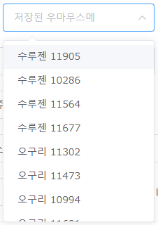

# 우마무스메 챔미 기록표 제작기
우마무스메 레이스 에뮬레이터로 말딸들의 기록표를 만드는 스크립트입니다.

[Tampermonkey](https://chrome.google.com/webstore/detail/tampermonkey/dhdgffkkebhmkfjojejmpbldmpobfkfo)가 필요합니다.

[스크립트 설치](https://github.com/Ravenclaw5874/Umamusume-Champions-Meeting-Laptime-Table-Generator/raw/main/Laptime-Table-Generator.user.js)

설치 후 [한국 우마무스메 레이스 에뮬레이터](http://race-ko.wf-calc.net/#/champions-meeting) 사이트에서

비교를 원하는 말딸들을 '말딸 평점' 형식(ex. 오구리 12345)으로 저장해놓고

'기록표 제작 시작' 버튼을 누르면

시뮬후 csv파일이 다운로드 됩니다.

이를 구글 스프레드시트 등에 가져와서 사용하시면 됩니다.
